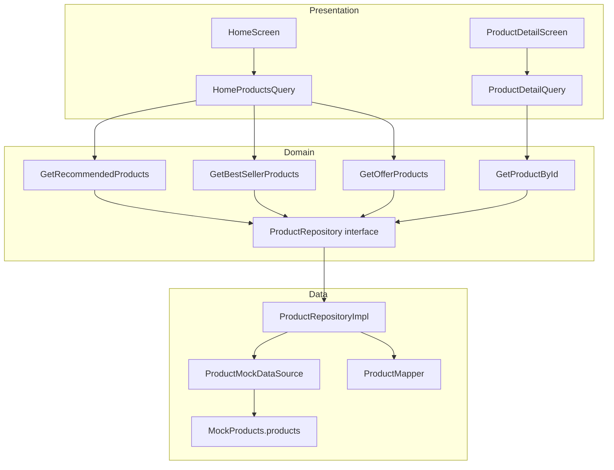

# Phase 2 — Products Clean Architecture Report

**Projekti:** Cava Premium (`cava_ecommerce`)  
**Data:** 6 korrik 2026  
**Scope:** Products feature — domain → use cases → repository → mock datasource  
**Kufizime:** UI identik, pa Firebase real, pa prekje Cart/Wishlist/Checkout/Auth

---

## Përmbledhje

Phase 2 krijoi Products feature me Clean Architecture të plotë për leximin e produkteve. **HomeScreen** dhe **ProductDetailScreen** nuk varen më nga `CatalogFacade.products` — përdorin use cases përmes query helpers. Mock data (`MockProducts`) mbeti i paprekur. Firebase nuk u lidh. `main.dart` nuk u ndryshua.

```bash
flutter analyze
# → No issues found! (ran in 1.0s)
```

---

## 1. Skedarët e krijuar

### Domain

| Skedar | Qëllimi |
|--------|---------|
| `lib/features/products/domain/repositories/product_repository.dart` | Interface abstrakte e repository-t |
| `lib/features/products/domain/usecases/get_recommended_products.dart` | Use case: produkte të rekomanduara |
| `lib/features/products/domain/usecases/get_best_seller_products.dart` | Use case: më të shiturat |
| `lib/features/products/domain/usecases/get_offer_products.dart` | Use case: oferta |
| `lib/features/products/domain/usecases/get_product_by_id.dart` | Use case: produkt sipas ID |

### Data

| Skedar | Qëllimi |
|--------|---------|
| `lib/features/products/data/models/product_model.dart` | DTO me `fromJson`/`toJson` për Firestore |
| `lib/features/products/data/mappers/product_mapper.dart` | Konvertim Model ↔ Entity |
| `lib/features/products/data/datasources/product_data_source.dart` | Interface datasource |
| `lib/features/products/data/datasources/product_mock_datasource.dart` | Implementim mock (lexon `MockProducts`) |
| `lib/features/products/data/repositories/product_repository_impl.dart` | Implementim repository |

### Presentation (helpers — jo UI widgets)

| Skedar | Qëllimi |
|--------|---------|
| `lib/features/products/presentation/products_module.dart` | Trigger i `configureDependencies()` |
| `lib/features/products/presentation/home_products_query.dart` | Bridge Home → use cases |
| `lib/features/products/presentation/product_detail_query.dart` | Bridge ProductDetail → use case |

---

## 2. Skedarët e refaktoruar

| Skedar | Ndryshimi |
|--------|-----------|
| `lib/core/di/injection.dart` | Regjistrime reale: datasource, repository, 4 use cases |
| `lib/features/categories/data/repositories/catalog_repository.dart` | `ProductRepository` → `CatalogProductRepository` (adapter te domain repo) |
| `lib/features/home/presentation/screens/home_screen.dart` | Produktet nga `HomeProductsQuery` në vend të `_catalog.products` |
| `lib/features/products/presentation/screens/product_detail_screen.dart` | Produkti nga `ProductDetailQuery.byId()` — hequr `CatalogFacade` |

---

## 3. Çfarë u largua nga UI

| Para | Pas |
|------|-----|
| `HomeScreen`: `_catalog.products.getRecommended()` | `HomeProductsQuery.recommended()` |
| `HomeScreen`: `_catalog.products.getBestSellers()` | `HomeProductsQuery.bestSellers()` |
| `HomeScreen`: `_catalog.products.getOffers()` | `HomeProductsQuery.offers()` |
| `ProductDetailScreen`: `_catalog.products.getById(id)` | `ProductDetailQuery.byId(id)` |
| `ProductDetailScreen`: `static final _catalog = CatalogFacade()` | **Hequr** |

**Çfarë mbeti në UI (pa ndryshim):**
- `HomeScreen` përdor ende `_catalog.categories.getAll()` për kategori (Phase 3)
- Layout, widget tree, tekste, spacing, ngjyra — **identike**
- `ProductDetailScreen` mbeti `StatefulWidget` me të njëjtin TabController, quantity, bottom actions

---

## 4. A mbeti UI identik?

**Po — 100% identik në pamje dhe sjellje.**

| Aspekt | Status |
|--------|--------|
| Dizajn / layout | ✅ I njëjti widget tree |
| Spacing / ngjyra / font | ✅ Pa ndryshime |
| Tekste (shqip) | ✅ Pa ndryshime |
| Animacione | ✅ Pa ndryshime |
| Routing / flow | ✅ Pa ndryshime |
| Mock data output | ✅ I njëjti — datasource lexon `MockProducts.products` |
| Loading states | ✅ S’u shtuan — lexim sinkron përmes mock |
| Error UI | ✅ I njëjti — produkt null → "Produkti nuk u gjet" |

---

## 5. Çfarë është ende mock

| Komponent | Burimi |
|-----------|--------|
| Të gjitha produktet | `MockProducts.products` via `ProductMockDataSource` |
| Kategoritë (Home chips) | `MockCategories` via `CatalogFacade.categories` |
| Cart / Wishlist / Checkout / Auth | Mock ekzistues — **nuk u prekën** |
| Imazhet produkteve | Placeholder icons — `imageUrl` ende null |
| Firebase | `FirebaseConfig.enabled = false` — **jo i aktivizuar** |

---

## 6. Çfarë duhet për Firestore real (Phase 3)

| Hapi | Detaje |
|------|--------|
| 1 | `flutterfire configure` → `firebase_options.dart` |
| 2 | Krijo `ProductFirestoreDataSource implements ProductDataSource` |
| 3 | Repository interface: metoda `Future<>` (async) |
| 4 | Use cases: migro nga `SyncUseCase` → `BaseUseCase` (async) |
| 5 | Presentation: `HomeProductsQuery` / ViewModels me loading/error states |
| 6 | DI: `sl.registerLazySingleton<ProductDataSource>(() => ProductFirestoreDataSource(...))` |
| 7 | Aktivizo `FirebaseInitializer` në `main.dart` |
| 8 | Firestore security rules + indekse |

**Skedar i ri i pritur:**
```
lib/features/products/data/datasources/product_firestore_datasource.dart
```

---

## 7. Kompromiset e bëra

| Kompromis | Arsye | Faza e ardhshme |
|-----------|-------|-----------------|
| **Repository sinkron** (`List<T>` jo `Future<List<T>>`) | Shmang flicker në UI pa loading states | Async në Phase 3 |
| **SyncUseCase** në vend të BaseUseCase async | Home/ProductDetail mbeten sync në `build()` | Async use cases + ViewModel |
| **HomeProductsQuery / ProductDetailQuery** | Thin static helpers — jo ViewModel/Bloc | Zëvendësohen me ViewModels |
| **CatalogProductRepository adapter** | `CategoryProductsScreen` ende përdor `CatalogFacade.products` — jashtë scope | Refaktor categories në Phase 3 |
| **`configureDependencies()` sync** | Mock nuk kërkon init async | Async init kur Firebase aktivizohet |
| **DI lazy via first screen access** | `main.dart` i paprekur | Thirr `configureDependencies()` nga `main()` |
| **ProductModel.fromEntity** në mock | Mapper ekziston por mock lexon entity→model→entity | Firestore përdor `fromJson` direkt |

---

## 8. Diagrami i rrjedhës (Phase 2)



### Backward compat (jashtë scope Phase 2)

```
CategoryProductsScreen → CatalogFacade → CatalogProductRepository → ProductRepository (domain)
```

---

## 9. Struktura e re e `features/products/`

```
lib/features/products/
├── domain/
│   ├── entities/
│   │   └── product_entity.dart          (ekzistonte)
│   ├── repositories/
│   │   └── product_repository.dart      ← NEW interface
│   └── usecases/
│       ├── get_recommended_products.dart
│       ├── get_best_seller_products.dart
│       ├── get_offer_products.dart
│       └── get_product_by_id.dart
├── data/
│   ├── mock/
│   │   └── mock_products.dart           (i paprekur)
│   ├── models/
│   │   └── product_model.dart
│   ├── mappers/
│   │   └── product_mapper.dart
│   ├── datasources/
│   │   ├── product_data_source.dart
│   │   └── product_mock_datasource.dart
│   └── repositories/
│       └── product_repository_impl.dart
└── presentation/
    ├── products_module.dart
    ├── home_products_query.dart
    ├── product_detail_query.dart
    └── screens/
        └── product_detail_screen.dart   (refaktoruar — vetëm data source)
```

---

## 10. Çfarë NUK u prek

| Zona | Status |
|------|--------|
| `main.dart` | ✅ Pa ndryshime |
| `FirebaseInitializer` | ✅ Jo i thirrur |
| Mock data content | ✅ `MockProducts` i njëjtë |
| Cart / Wishlist / Checkout / Auth | ✅ Pa ndryshime |
| Routing | ✅ Pa ndryshime |
| Core widgets / theme | ✅ Pa ndryshime |
| `CategoryProductsScreen` | ✅ Ende `CatalogFacade` (via adapter) |

---

## 11. Rezultatet e `flutter analyze`

```
Analyzing cava_ecommerce...
No issues found! (ran in 1.0s)
```

---

## 12. Hapi tjetër (Phase 3 — jo filluar)

1. `ProductFirestoreDataSource` + async repository
2. Home ViewModel me loading/error (layout i njëjtë)
3. Categories Clean Architecture (heq `CatalogFacade.products` plotësisht)
4. `flutterfire configure` + aktivizim Firebase
5. `cached_network_image` në product widgets kur `imageUrl` vjen nga Firestore

---

*Phase 2 complete. Products feature ka Clean Architecture layer. UI identik. Mock data aktiv. Firebase jo i lidhur.*
