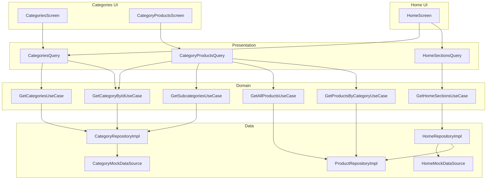

# Phase 3 — Categories + Home Sections Clean Architecture Report

**Projekti:** Cava Premium (`cava_ecommerce`)  
**Data:** 7 korrik 2026  
**Scope:** Categories feature + Home sections — pa Firebase, pa ndryshime UI  
**Kufizime:** Cart, Wishlist, Checkout, Auth — të paprekura

---

## Përmbledhje

Phase 3 plotësoi Clean Architecture për **kategoritë**, **subkategoritë**, dhe **seksionet e Home**. Asnjë ekran nuk përdor më `CatalogFacade` ose mock data direkt. Home sections kanë strukturë domain/data gati për Firestore. UI mbeti identik.

```bash
flutter analyze
# → No issues found!
```

---

## 1. Skedarët e krijuar

### Categories — Domain

| Skedar | Qëllimi |
|--------|---------|
| `lib/features/categories/domain/repositories/category_repository.dart` | Interface abstrakte |
| `lib/features/categories/domain/usecases/get_categories.dart` | Lista e kategorive |
| `lib/features/categories/domain/usecases/get_category_by_id.dart` | Kategori sipas ID |
| `lib/features/categories/domain/usecases/get_subcategories.dart` | Subkategoritë për kategori |

### Categories — Data

| Skedar | Qëllimi |
|--------|---------|
| `lib/features/categories/data/models/category_model.dart` | DTO + `fromJson` |
| `lib/features/categories/data/models/subcategory_model.dart` | DTO subkategori |
| `lib/features/categories/data/mappers/category_mapper.dart` | Model ↔ Entity |
| `lib/features/categories/data/mappers/subcategory_mapper.dart` | Model ↔ Entity |
| `lib/features/categories/data/datasources/category_data_source.dart` | Interface datasource |
| `lib/features/categories/data/datasources/category_mock_datasource.dart` | Lexon `MockCategories` + `MockSubcategories` |
| `lib/features/categories/data/repositories/category_repository_impl.dart` | Implementim repository |

### Categories — Presentation

| Skedar | Qëllimi |
|--------|---------|
| `lib/features/categories/presentation/categories_module.dart` | Trigger DI |
| `lib/features/categories/presentation/categories_query.dart` | Bridge → use cases (lista, byId) |
| `lib/features/categories/presentation/category_products_query.dart` | Bridge → produkte + subkategori |

### Home — Domain

| Skedar | Qëllimi |
|--------|---------|
| `lib/features/home/domain/entities/home_section_entity.dart` | Entitet seksioni + `HomeSectionType` |
| `lib/features/home/domain/repositories/home_repository.dart` | Interface repository |
| `lib/features/home/domain/usecases/get_home_sections.dart` | Use case seksionet |

### Home — Data

| Skedar | Qëllimi |
|--------|---------|
| `lib/features/home/data/models/home_section_model.dart` | Metadata seksioni (title, route, type) |
| `lib/features/home/data/mappers/home_section_mapper.dart` | Model → Entity + produkte |
| `lib/features/home/data/datasources/home_data_source.dart` | Interface datasource |
| `lib/features/home/data/datasources/home_mock_datasource.dart` | 3 seksione statike (titull/route) |
| `lib/features/home/data/repositories/home_repository_impl.dart` | Zgjidh produkte via `ProductRepository` |

### Home — Presentation

| Skedar | Qëllimi |
|--------|---------|
| `lib/features/home/presentation/home_module.dart` | Trigger DI |
| `lib/features/home/presentation/home_sections_query.dart` | Bridge → `GetHomeSectionsUseCase` |

### Products — Use cases të reja (për CategoryProductsScreen)

| Skedar | Qëllimi |
|--------|---------|
| `lib/features/products/domain/usecases/get_all_products.dart` | Të gjitha produktet |
| `lib/features/products/domain/usecases/get_products_by_category.dart` | Produkte sipas kategorie |

**Total: 25 skedarë të rinj**

---

## 2. Skedarët e refaktoruar

| Skedar | Ndryshimi |
|--------|-----------|
| `lib/core/di/injection.dart` | Regjistrime categories, home, 2 product use cases |
| `lib/features/home/presentation/screens/home_screen.dart` | `CategoriesQuery` + `HomeSectionsQuery` — hequr `CatalogFacade` |
| `lib/features/categories/presentation/screens/categories_screen.dart` | `CategoriesQuery` + `CategoryProductsQuery` — hequr mock/catalog direkt |
| `lib/features/categories/data/repositories/catalog_repository.dart` | Vetëm deprecated adapters — hequr `CategoryRepository` konkret |

---

## 3. Çfarë u largua nga UI

| Ekran | Para | Pas |
|-------|------|-----|
| **HomeScreen** | `_catalog.categories.getAll()` | `CategoriesQuery.getAll()` |
| **HomeScreen** | `HomeProductsQuery.recommended/bestSellers/offers` | `HomeSectionsQuery.getSections()` |
| **HomeScreen** | `static final _catalog = CatalogFacade()` | **Hequr** |
| **CategoriesScreen** | `CategoryRepository().getAll()` | `CategoriesQuery.getAll()` |
| **CategoryProductsScreen** | `_catalog.categories.getById()` | `CategoryProductsQuery.categoryById()` |
| **CategoryProductsScreen** | `_catalog.products.getAll/getProductsByCategory` | `CategoryProductsQuery.productsFor()` |
| **CategoryProductsScreen** | `MockSubcategories.forCategory()` | `CategoryProductsQuery.subcategoriesFor()` |
| **CategoryProductsScreen** | `static final _catalog = CatalogFacade()` | **Hequr** |
| **CategoryProductsScreen** | `import mock_subcategories.dart` | **Hequr** |

**Çfarë mbeti në UI (identik):**
- `_filteredProducts()` + `SubcategoryFilter` — logjikë filtrimi në presentation (e njëjta)
- Widget tree, spacing, tekste, routes `seeAllRoute`
- `VisitStoreBanner`, `CategoryChipBar`, `ProductSection` — pa ndryshime

---

## 4. A mbeti UI identik?

**Po — 100% identik.**

| Aspekt | Status |
|--------|--------|
| Layout / widget tree | ✅ |
| Titull seksionesh: "Të rekomanduara", "Më të shiturat", "Oferta" | ✅ (nga `HomeMockDataSource`) |
| `seeAllRoute`: `/category/wines`, `/category/spirits` | ✅ |
| Kategori chips | ✅ (5 kategori mock) |
| Category grid / product grid | ✅ |
| Subcategory chips + search | ✅ |
| "All Products" / subcategory "All Products" për `categoryId == 'all'` | ✅ (hardcoded në query — si më parë) |
| Loading / error states | ✅ S’u shtuan |

---

## 5. Çfarë është ende mock

| Burim | Përdorim |
|-------|----------|
| `MockCategories.categories` | Via `CategoryMockDataSource` |
| `MockSubcategories.*` | Via `CategoryMockDataSource.getSubcategories()` |
| `MockProducts.products` | Via `ProductMockDataSource` → home sections + category products |
| `HomeMockDataSource._sections` | Metadata seksionesh (title, route, type) — **i ri, jo Firestore** |
| `VisitStoreBanner` | Widget statik — jashtë scope |
| Cart / Wishlist / Checkout / Auth | Mock ekzistues — **paprekur** |

---

## 6. Çfarë mbetet nga CatalogFacade

| Komponent | Status |
|-----------|--------|
| `CatalogFacade` | **Deprecated** — asnjë ekran nuk e importon |
| `CatalogProductRepository` | **Deprecated** — adapter legacy në `catalog_repository.dart` |
| `CategoryRepository` (klasa konkrete e vjetër) | **Hequr** — zëvendësuar nga domain interface + impl |

**Skedari `catalog_repository.dart`** mbetet vetëm për backward compatibility (@Deprecated). Mund të fshihet kur të verifikohet që asnjë import extern nuk ekziston.

**`HomeProductsQuery`** — ekziston ende por **nuk përdoret** nga HomeScreen. Zëvendësuar nga `HomeSectionsQuery`.

---

## 7. A është Home gati për Firestore?

| Aspekt | Status | Detaje |
|--------|--------|--------|
| Domain entity | ✅ | `HomeSectionEntity` me type, title, route, products |
| Repository interface | ✅ | `HomeRepository.getSections()` |
| Datasource swap | ⚠️ Partial | Duhet `HomeFirestoreDataSource` për metadata seksionesh |
| Async reads | ❌ | Ende sinkron — duhet `Future<>` në Phase 4 |
| Promotions / Banners | ❌ | Vetëm 3 product sections — jo entitet Promotion |
| Visit Store | ❌ | Statik — koleksion Firestore `banners` në fazë tjetër |

**Verdict:** **Partial** — struktura gati; duhet Firestore datasource + async + loading states.

---

## 8. A janë Categories gati për Firestore?

| Aspekt | Status | Detaje |
|--------|--------|--------|
| Domain interface | ✅ | `CategoryRepository` |
| Models + mappers | ✅ | `CategoryModel`, `SubcategoryModel` me `fromJson` |
| Datasource swap | ⚠️ Partial | Duhet `CategoryFirestoreDataSource` |
| Subcategories | ✅ | Logjika në datasource — Firestore subcollection ose embedded |
| Async reads | ❌ | Ende sinkron |
| Filtrimi UI | ⚠️ | `SubcategoryFilter` mbetet në presentation |

**Verdict:** **Partial** — swap datasource + async është hapi kryesor.

---

## 9. Kompromiset

| Kompromis | Arsye |
|-----------|-------|
| **Sync repository/use cases** | UI identik pa loading flicker (si Phase 2) |
| **Query helpers statikë** | `CategoriesQuery`, `HomeSectionsQuery` — jo ViewModels |
| **`categoryId == 'all'` subcategories hardcoded** | UI kërkonte `'All Products'` label — jo nga `MockSubcategories` |
| **`HomeRepositoryImpl` thërret `ProductRepository` direkt** | Aggregon produkte për seksion — acceptable në data layer |
| **`catalog_repository.dart` deprecated** | Backward compat — jo fshirë |
| **`HomeProductsQuery` i papërdorur** | Mbajtur — mund të hiqet në cleanup |
| **`firstWhere` pa fallback në HomeScreen** | Mock gjithmonë kthen 3 seksione — crash nëse mock ndryshon |

---

## 10. Diagrami i rrjedhës



---

## 11. Struktura e re

```
lib/features/categories/
├── domain/repositories/category_repository.dart    ← NEW interface
├── domain/usecases/                              ← 3 use cases
├── data/models/                                  ← category + subcategory models
├── data/mappers/
├── data/datasources/
├── data/repositories/category_repository_impl.dart
└── presentation/
    ├── categories_module.dart
    ├── categories_query.dart
    └── category_products_query.dart

lib/features/home/
├── domain/entities/home_section_entity.dart      ← NEW
├── domain/repositories/home_repository.dart
├── domain/usecases/get_home_sections.dart
├── data/models/home_section_model.dart
├── data/mappers/home_section_mapper.dart
├── data/datasources/
├── data/repositories/home_repository_impl.dart
└── presentation/
    ├── home_module.dart
    └── home_sections_query.dart
```

---

## 12. Çfarë NUK u prek

| Zona | Status |
|------|--------|
| `main.dart` / Firebase | ✅ |
| Mock data content | ✅ |
| Cart / Wishlist / Checkout / Auth | ✅ |
| Routing | ✅ |
| ProductDetailScreen | ✅ (Phase 2) |
| Core widgets / theme | ✅ |

---

## 13. Rezultatet e `flutter analyze`

```
Analyzing cava_ecommerce...
No issues found!
```

---

## 14. Hapi tjetër (Phase 4 — jo filluar)

1. `CategoryFirestoreDataSource` + `HomeFirestoreDataSource`
2. Async repository + use cases
3. ViewModels me loading/error (layout i njëjtë)
4. `flutterfire configure` + aktivizim Firebase
5. Cleanup: hiq `CatalogFacade`, `HomeProductsQuery` deprecated
6. Promotions / Banners entities për home dinamik

---

*Phase 3 complete. Home dhe Categories nuk varen më nga CatalogFacade. UI identik. Mock aktiv. Firebase jo i lidhur.*
