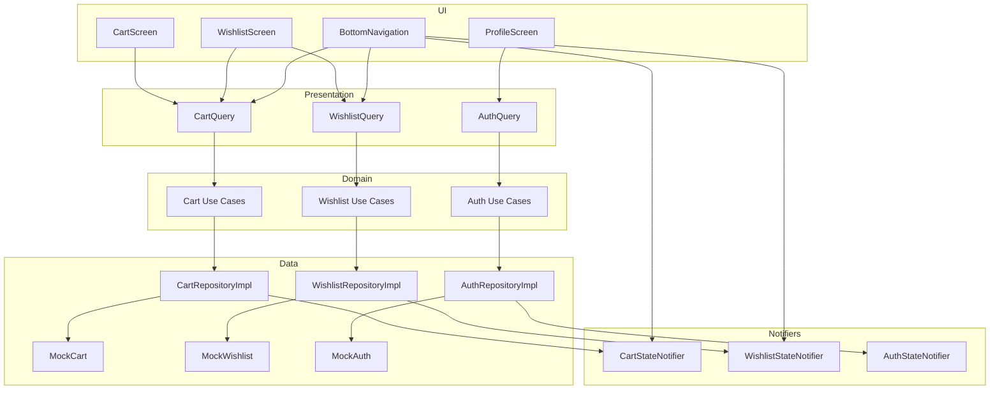

# Phase 4 — Cart, Wishlist & Auth Clean Architecture Report

**Projekti:** Cava Premium (`cava_ecommerce`)  
**Data:** 7 korrik 2026  
**Scope:** Cart, Wishlist, Auth state — pa Firebase, pa ndryshime UI  
**Kufizime:** Products, Categories, Home, Checkout — të paprekura (Checkout ende lexon `MockCart` direkt)

---

## Përmbledhje

Phase 4 zëvendësoi importet direkte të mock në **CartScreen**, **WishlistScreen**, **ProfileScreen** dhe **BottomNavigation** me Clean Architecture: repository interfaces → mock datasources → use cases → query helpers. Badge count vazhdon të funksionojë përmes `core/state` notifiers. UI mbeti identik.

```bash
flutter analyze
# → No issues found! (ran in 2.1s)
```

---

## 1. Skedarët e krijuar

### Core — State notifiers

| Skedar | Qëllimi |
|--------|---------|
| `lib/core/state/cart_state_notifier.dart` | `ValueNotifier<int>` për cart badge + rebuild |
| `lib/core/state/wishlist_state_notifier.dart` | `ValueNotifier<int>` për wishlist badge + rebuild |
| `lib/core/state/auth_state_notifier.dart` | `ValueNotifier<bool>` për auth state |

### Cart — Domain

| Skedar | Qëllimi |
|--------|---------|
| `lib/features/cart/domain/repositories/cart_repository.dart` | Interface |
| `lib/features/cart/domain/usecases/get_cart_items.dart` | |
| `lib/features/cart/domain/usecases/add_to_cart.dart` | |
| `lib/features/cart/domain/usecases/remove_from_cart.dart` | |
| `lib/features/cart/domain/usecases/update_cart_quantity.dart` | |
| `lib/features/cart/domain/usecases/clear_cart.dart` | |
| `lib/features/cart/domain/usecases/get_cart_count.dart` | |

### Cart — Data & Presentation

| Skedar | Qëllimi |
|--------|---------|
| `lib/features/cart/data/datasources/cart_data_source.dart` | Interface |
| `lib/features/cart/data/datasources/cart_mock_datasource.dart` | Delegon te `MockCart` |
| `lib/features/cart/data/repositories/cart_repository_impl.dart` | Impl + notifier update |
| `lib/features/cart/presentation/cart_module.dart` | DI trigger |
| `lib/features/cart/presentation/cart_query.dart` | Bridge presentation → use cases |

### Wishlist — Domain, Data & Presentation

| Skedar | Qëllimi |
|--------|---------|
| `lib/features/wishlist/domain/repositories/wishlist_repository.dart` | Interface |
| `lib/features/wishlist/domain/usecases/get_wishlist_items.dart` | |
| `lib/features/wishlist/domain/usecases/toggle_wishlist.dart` | |
| `lib/features/wishlist/domain/usecases/remove_from_wishlist.dart` | |
| `lib/features/wishlist/domain/usecases/is_in_wishlist.dart` | |
| `lib/features/wishlist/domain/usecases/get_wishlist_count.dart` | |
| `lib/features/wishlist/data/datasources/wishlist_data_source.dart` | |
| `lib/features/wishlist/data/datasources/wishlist_mock_datasource.dart` | |
| `lib/features/wishlist/data/repositories/wishlist_repository_impl.dart` | |
| `lib/features/wishlist/presentation/wishlist_module.dart` | |
| `lib/features/wishlist/presentation/wishlist_query.dart` | |

### Auth (Account) — Domain, Data & Presentation

| Skedar | Qëllimi |
|--------|---------|
| `lib/features/account/domain/repositories/auth_repository.dart` | Interface |
| `lib/features/account/domain/usecases/is_logged_in.dart` | |
| `lib/features/account/domain/usecases/login.dart` | |
| `lib/features/account/domain/usecases/logout.dart` | |
| `lib/features/account/data/datasources/auth_data_source.dart` | |
| `lib/features/account/data/datasources/auth_mock_datasource.dart` | |
| `lib/features/account/data/repositories/auth_repository_impl.dart` | |
| `lib/features/account/presentation/auth_module.dart` | |
| `lib/features/account/presentation/auth_query.dart` | |

**Total: 33 skedarë të rinj**

---

## 2. Skedarët e refaktoruar

| Skedar | Ndryshimi |
|--------|-----------|
| `lib/core/di/injection.dart` | `_registerCart()`, `_registerWishlist()`, `_registerAuth()` |
| `lib/features/cart/presentation/screens/cart_screen.dart` | `CartQuery` në vend të `MockCart` |
| `lib/features/wishlist/presentation/screens/wishlist_screen.dart` | `WishlistQuery` + `CartQuery.addProduct` |
| `lib/features/account/presentation/screens/profile_screen.dart` | `AuthQuery` në vend të `MockAuth` |
| `lib/core/widgets/bottom_navigation.dart` | State notifiers + query helpers |

---

## 3. Importimet mock të larguara nga UI

| Skedar | Import i hequr |
|--------|----------------|
| `cart_screen.dart` | `../../data/mock/mock_cart.dart` |
| `wishlist_screen.dart` | `mock_wishlist.dart`, `mock_cart.dart` |
| `profile_screen.dart` | `../../data/mock/mock_auth.dart` |
| `bottom_navigation.dart` | `mock_cart.dart`, `mock_wishlist.dart` |

**Mock mbeten vetëm në data layer:**

| Mock | Përdorur nga |
|------|--------------|
| `MockCart` | `CartMockDataSource`, `checkout_screen.dart` *(jashtë scope)* |
| `MockWishlist` | `WishlistMockDataSource` |
| `MockAuth` | `AuthMockDataSource` |

---

## 4. A mbeti UI identik?

**Po — 100% identik.**

| Aspekt | Status |
|--------|--------|
| Layout cart items, order summary, footer | ✅ |
| Wishlist list, remove, "Shto në shportë" | ✅ |
| Profile header "Kyçu" / "Urim Tusha" | ✅ |
| Bottom nav badges (wishlist + cart) | ✅ |
| ValueListenableBuilder rebuild pattern | ✅ (notifiers të rinj, i njëjti pattern) |
| Tekste, ngjyra, spacing | ✅ |

---

## 5. Si punon badge count tani

```
Mutacion (add/remove/update)
        ↓
Use Case → CartRepositoryImpl / WishlistRepositoryImpl
        ↓
CartMockDataSource / WishlistMockDataSource → MockCart / MockWishlist
        ↓
RepositoryImpl → CartStateNotifier.update(count) / WishlistStateNotifier.update(count)
        ↓
BottomNavigation: ValueListenableBuilder(CartStateNotifier.revision)
                  + CartQuery.itemCount / WishlistQuery.count
        ↓
Badge widget (i njëjti si më parë)
```

| Badge | Notifier | Count source |
|-------|----------|--------------|
| Cart (tab 2) | `CartStateNotifier.revision` | `CartQuery.itemCount` → `GetCartCountUseCase` |
| Wishlist (tab 1) | `WishlistStateNotifier.revision` | `WishlistQuery.count` → `GetWishlistCountUseCase` |

**Ndryshim kyç:** Widget-et **nuk** dëgjojnë më `MockCart.revision` / `MockWishlist.revision` direkt — dëgjojnë notifiers në `core/state`, të përditësuar nga repository impl pas çdo mutacioni.

---

## 6. Çfarë është ende mock

| Feature | Burimi | Firebase-ready? |
|---------|--------|-----------------|
| Cart items & totals | `MockCart` via `CartMockDataSource` | Partial — duhet Firestore/local cart |
| Wishlist | `MockWishlist` via `WishlistMockDataSource` | Partial — user subcollection |
| Auth | `MockAuth` (tap "Kyçu" → login) | Not Ready — duhet Firebase Auth |
| Checkout total | `MockCart.total` direkt *(checkout_screen)* | Jashtë Phase 4 scope |

**Mock data content** — i paprekur (3 cart items, 3 wishlist products, `userName = 'Urim Tusha'`).

---

## 7. Çfarë duhet për Firebase më vonë

### Cart (Firestore / local)

| Hapi | Detaje |
|------|--------|
| 1 | `CartFirestoreDataSource` ose `CartLocalDataSource` (SharedPreferences/Hive) |
| 2 | Sync me user ID pas Firebase Auth |
| 3 | Async repository + use cases |
| 4 | Refaktoro `checkout_screen.dart` → `CartQuery.total` |

### Wishlist (Firestore)

| Hapi | Detaje |
|------|--------|
| 1 | `users/{uid}/wishlist` subcollection |
| 2 | `WishlistFirestoreDataSource` |
| 3 | Real-time listener → notifier update |

### Auth (Firebase Auth)

| Hapi | Detaje |
|------|--------|
| 1 | `flutterfire configure` + Firebase Auth |
| 2 | `AuthFirebaseDataSource` — `signInWithEmail`, `signOut`, `authStateChanges()` |
| 3 | `AuthStateNotifier` lidhet me Firebase stream |
| 4 | Login screen + route guards |
| 5 | Zëvendëso `LoginUseCase` mock me credential flow |

---

## 8. Kompromiset

| Kompromis | Arsye |
|-----------|-------|
| **Sync use cases** | UI identik, pa loading states (si Phase 2–3) |
| **CartQuery lexon summary nga repository direkt** | Nuk u kërkuan use cases për subtotal/vat/shipping |
| **Dual notifier** | `MockCart.revision` ende përditësohet në mock + `CartStateNotifier` — checkout vazhdon me mock revision path |
| **Checkout jashtë scope** | Ende importon `MockCart` — funksionon sepse datasource shkruan të njëjtin `MockCart.items` |
| **Query helpers statikë** | Jo ViewModels/Bloc |
| **`ToggleWishlistUseCase` / `ClearCartUseCase`** | Regjistruar por UI nuk i thërret ende — gati për product detail / order success |
| **`LogoutUseCase`** | Regjistruar — profile nuk ka logout button ende |

---

## 9. Diagrami i rrjedhës



---

## 10. Struktura e re

```
lib/core/state/
├── cart_state_notifier.dart       ← NEW
├── wishlist_state_notifier.dart   ← NEW
└── auth_state_notifier.dart       ← NEW

lib/features/cart/
├── domain/repositories/ + usecases/ (6)
├── data/datasources/ + repositories/
└── presentation/cart_query.dart

lib/features/wishlist/
├── domain/repositories/ + usecases/ (5)
├── data/datasources/ + repositories/
└── presentation/wishlist_query.dart

lib/features/account/
├── domain/repositories/ + usecases/ (3)
├── data/datasources/ + repositories/
└── presentation/auth_query.dart
```

---

## 11. Çfarë NUK u prek

| Zona | Status |
|------|--------|
| Products, Categories, Home | ✅ |
| `main.dart` / Firebase | ✅ |
| Mock data content | ✅ |
| Checkout screen | ✅ *(ende MockCart — jashtë scope)* |
| Routing / flow | ✅ |
| UI dizajn | ✅ |

---

## 12. Rezultatet e `flutter analyze`

```
Analyzing cava_ecommerce...
No issues found! (ran in 2.1s)
```

---

## 13. Hapi tjetër (Phase 5 — jo filluar)

1. Refaktoro `checkout_screen.dart` → `CartQuery`
2. Firebase Auth + login screen
3. Firestore cart/wishlist sync
4. Async repositories + error handling
5. Hiq `MockCart.revision` / `MockWishlist.revision` nga mock (optional cleanup)

---

*Phase 4 complete. Cart, Wishlist, Auth kanë Clean Architecture. UI identik. Badge count funksional. Firebase jo i lidhur.*
