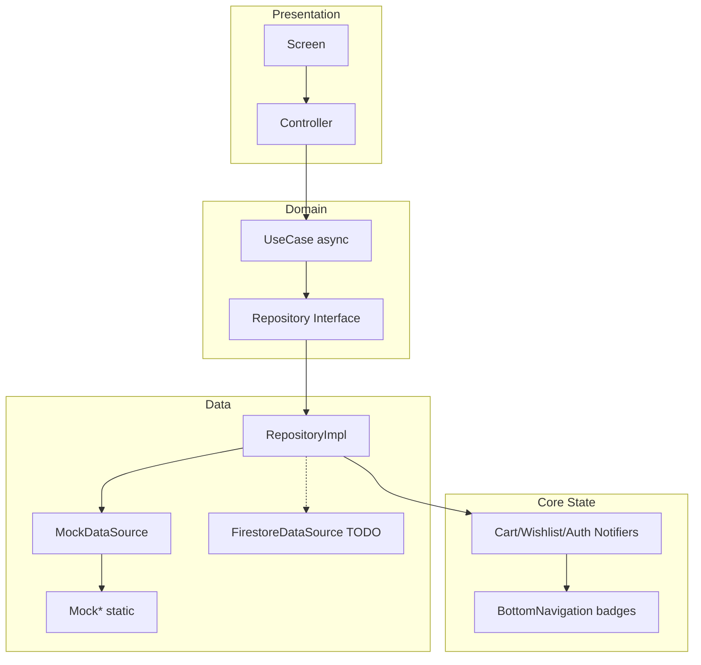

# Phase 5 — Async Architecture & Firebase Readiness Report

**Projekti:** Cava Premium (`cava_ecommerce`)  
**Data:** 7 korrik 2026  
**Scope:** Migrim async (repositories, use cases, controllers) + Firestore/Firebase datasource placeholders  
**Kufizime:** UI 100% identik, pa Firebase real, pa `FirebaseInitializer`, pa ndryshim mock data

---

## Përmbledhje

Phase 5 kaloi arkitekturën nga query helpers sync/static në **async repositories → async use cases → controllers (ChangeNotifier)**. Ekranet lexojnë të dhëna përmes `FutureBuilder` + `ListenableBuilder`, duke ruajtur layout-in ekzistues. **CheckoutScreen** u shkëput nga `MockCart`. U krijuan **Firestore/Firebase datasource placeholders** (të papërdorura). Firebase **nuk** u aktivizua në `main.dart`.

```bash
flutter analyze
# → No issues found! (ran in 1.9s)
```

---

## 1. Skedarët e krijuar

### Core — Presentation

| Skedar | Qëllimi |
|--------|---------|
| `lib/core/presentation/base_controller.dart` | `BaseController extends ChangeNotifier` me `runLoad` / `runAction` |
| `lib/core/presentation/result_extensions.dart` | `unwrapResult`, `unwrapFutureResult` për controllers |
| `lib/core/presentation/navigation_badge_controller.dart` | Badge count pa import mock/data |

### Core — State (përditësuar)

| Skedar | Ndryshim |
|--------|----------|
| `lib/core/state/auth_state_notifier.dart` | Shtuar `Stream<bool>` broadcast për auth state |

### Domain — Cart

| Skedar | Qëllimi |
|--------|---------|
| `lib/features/cart/domain/entities/cart_summary_entity.dart` | Agregim items + totals |
| `lib/features/cart/domain/usecases/get_cart_summary.dart` | Use case async për summary |

### Controllers (presentation)

| Skedar | Feature |
|--------|---------|
| `lib/features/home/presentation/controllers/home_controller.dart` | Home |
| `lib/features/products/presentation/controllers/product_detail_controller.dart` | Product detail |
| `lib/features/categories/presentation/controllers/categories_controller.dart` | Categories |
| `lib/features/categories/presentation/controllers/category_products_controller.dart` | Category products |
| `lib/features/cart/presentation/controllers/cart_controller.dart` | Cart |
| `lib/features/wishlist/presentation/controllers/wishlist_controller.dart` | Wishlist |
| `lib/features/account/presentation/controllers/auth_controller.dart` | Auth / Profile |
| `lib/features/checkout/presentation/controllers/checkout_controller.dart` | Checkout totals |

> **Shënim:** Emërtimi është `*Controller` (extends `BaseController`). Funksionaliteti mbulon rolin e ViewModel-it të kërkuar — nuk u krijuan klasa të dyfishta Controller + ViewModel për të shmangur duplikimin.

### Firestore / Firebase placeholders (data layer, të papërdorura)

| Skedar | Paketa e ardhshme |
|--------|-------------------|
| `lib/features/products/data/datasources/product_firestore_datasource.dart` | `cloud_firestore` |
| `lib/features/categories/data/datasources/category_firestore_datasource.dart` | `cloud_firestore` |
| `lib/features/home/data/datasources/home_firestore_datasource.dart` | `cloud_firestore` |
| `lib/features/cart/data/datasources/cart_firestore_datasource.dart` | `cloud_firestore` |
| `lib/features/wishlist/data/datasources/wishlist_firestore_datasource.dart` | `cloud_firestore` |
| `lib/features/account/data/datasources/auth_firebase_datasource.dart` | `firebase_auth` |

Të gjitha hedhin `UnimplementedError` me komente `TODO(Phase 6)` dhe **nuk** janë regjistruar në `injection.dart`.

---

## 2. Skedarët e refaktoruar

### Repository interfaces → async

| Interface | Metodat kryesore |
|-----------|------------------|
| `ProductRepository` | `Future<List<ProductEntity>>`, `Future<ProductEntity?>` |
| `CategoryRepository` | `Future<List<CategoryEntity>>`, `Future<CategoryEntity?>`, `Future<List<SubcategoryEntity>>` |
| `HomeRepository` | `Future<List<HomeSectionEntity>>` |
| `CartRepository` | `Future<CartSummaryEntity>`, `Future<List<CartItemEntity>>`, `Future<double>` totals, `Future<void>` mutations |
| `WishlistRepository` | `Future<List<ProductEntity>>`, `Future<bool>`, `Future<void>`, `Future<int>` |
| `AuthRepository` | `Stream<bool> watchAuthState()`, `Future<bool>`, `Future<String>`, `Future<void>` |

### Repository implementations → async

- `product_repository_impl.dart`
- `category_repository_impl.dart`
- `home_repository_impl.dart`
- `cart_repository_impl.dart` (+ `getSummary()`)
- `wishlist_repository_impl.dart`
- `auth_repository_impl.dart` (+ `watchAuthState()` → `AuthStateNotifier.stream`)
- `catalog_repository.dart` (adapter i deprecuar — metodat tani `Future`)

### Use cases → `BaseUseCase` / `BaseUseCaseNoParams` async

Të 25 use cases në `lib/features/*/domain/usecases/` tani kthejnë `Future<Result<T>>` dhe përdorin `guard()` nga `result.dart`.

`SyncUseCase` / `SyncUseCaseNoParams` mbeten vetëm si kontrata legacy në `base_usecase.dart` — **asnjë use case aktiv nuk i përdor më**.

### Screens & widgets (vetëm wiring, UI identik)

| Skedar | Controller |
|--------|------------|
| `lib/features/home/presentation/screens/home_screen.dart` | `HomeController` |
| `lib/features/products/presentation/screens/product_detail_screen.dart` | `ProductDetailController` |
| `lib/features/categories/presentation/screens/categories_screen.dart` | `CategoriesController`, `CategoryProductsController` |
| `lib/features/cart/presentation/screens/cart_screen.dart` | `CartController` |
| `lib/features/wishlist/presentation/screens/wishlist_screen.dart` | `WishlistController` |
| `lib/features/account/presentation/screens/profile_screen.dart` | `AuthController` |
| `lib/features/checkout/presentation/screens/checkout_screen.dart` | `CheckoutController` |
| `lib/core/widgets/bottom_navigation.dart` | `NavigationBadgeController` + `ValueListenableBuilder` |

### DI

- `lib/core/di/injection.dart` — regjistruar `GetCartSummaryUseCase`

---

## 3. Query helpers — zëvendësuar vs mbetur

### Zëvendësuar nga controllers (screens nuk i përdorin më)

| Query helper (deprecated) | Zëvendësuar me |
|---------------------------|----------------|
| `HomeSectionsQuery` | `HomeController` |
| `HomeProductsQuery` | `HomeController` (sections nga `HomeRepository`) |
| `CategoriesQuery` | `CategoriesController` |
| `CategoryProductsQuery` | `CategoryProductsController` |
| `ProductDetailQuery` | `ProductDetailController` |
| `CartQuery` | `CartController` |
| `WishlistQuery` | `WishlistController` |
| `AuthQuery` | `AuthController` |

### Mbetur si query helper (backward compat, `@Deprecated`)

Skedarët ekzistojnë ende dhe janë **async**, por **asnjë screen aktiv nuk i importon**:

- `lib/features/home/presentation/home_sections_query.dart`
- `lib/features/products/presentation/home_products_query.dart`
- `lib/features/categories/presentation/categories_query.dart`
- `lib/features/categories/presentation/category_products_query.dart`
- `lib/features/products/presentation/product_detail_query.dart`
- `lib/features/cart/presentation/cart_query.dart`
- `lib/features/wishlist/presentation/wishlist_query.dart`
- `lib/features/account/presentation/auth_query.dart`

Mund të fshihen në Phase 6 pas verifikimit që nuk ka referenca të jashtme.

---

## 4. A mbeti UI identik?

**Po.** Nuk u ndryshuan:

- Dizajn, layout, spacing, ngjyra, tekst shqip
- Animacionet e bottom navigation
- Routing / flow (`go_router`)
- Komponentët vizualë (`ProductSection`, `CavaAppBar`, etj.)

Ndryshimet e lejuara:

- `StatefulWidget` + `initState` për controller
- `FutureBuilder<void>` për load fillestar
- `ListenableBuilder` / `ValueListenableBuilder` për rebuild
- Fallback sections në Home kur `sections` është bosh (e njëjta logjikë si më parë me `_fallbackSection`)

---

## 5. Async flow

```
Screen (FutureBuilder + ListenableBuilder)
    ↓
Controller (BaseController / ChangeNotifier)
    ↓ runLoad / runAction
UseCase (BaseUseCase → Future<Result<T>>)
    ↓ guard()
Repository interface (Future<T> / Stream<T>)
    ↓
RepositoryImpl (Future.sync / async wrapper mbi mock)
    ↓
MockDataSource → Mock* (data layer)
```

**Badge / auth reactive:**

```
CartRepositoryImpl / WishlistRepositoryImpl
    → CartStateNotifier / WishlistStateNotifier (ValueNotifier<int>)

AuthRepositoryImpl.watchAuthState()
    → AuthStateNotifier.stream (Stream<bool>)

BottomNavigation
    → ValueListenableBuilder(CartStateNotifier.revision)
    → NavigationBadgeController (pa mock imports)
```

Mock datasource mbetet **sync** brenda data layer; async simulohet me `Future.sync()` në repository impl — gati për zëvendësim me Firestore/HTTP pa prekur presentation.

---

## 6. Refaktorimi i CheckoutScreen

**Para (Phase 4):** import direkt `MockCart` për total.

**Pas (Phase 5):**

```dart
// checkout_screen.dart
_controller = createCheckoutController();
_loadFuture = _controller.load();
// ...
_CheckoutFooter(total: _controller.total, ...)
```

```dart
// checkout_controller.dart
CheckoutController(CartController) {
  double get total => _cartController.total;
  // subtotal, vat, shipping, discount — të disponueshme nga cart layer
  Future<void> load() => _cartController.load();
}
```

- **Hiqet** importi `MockCart`
- Total vjen nga `CartController` → `GetCartSummaryUseCase` → `CartRepository.getSummary()` → `CartSummaryEntity`
- UI footer mbeti identik (shfaq vetëm `total`, si më parë)

---

## 7. Mock imports në presentation

**Verifikim:** `grep` në `lib/**/presentation/**` për `mock`, `MockCart`, `datasource`, `repository_impl`, `firebase`.

| Kontroll | Rezultati |
|----------|-----------|
| `data/mock` imports | ❌ Asnjë |
| `MockCart` / `Mock*` | ❌ Asnjë (vetëm koment në `navigation_badge_controller.dart`) |
| Datasource konkrete | ❌ Asnjë |
| Repository impl | ❌ Asnjë |
| Firebase packages | ❌ Asnjë |

**Përjashtim i lejuar:** `AuthController` importon `AuthRepository` (**domain interface**, jo impl) për `watchAuthState()` stream.

---

## 8. Firebase datasource placeholders

| Klasa | Status | Regjistrim DI |
|-------|--------|---------------|
| `ProductFirestoreDataSource` | `UnimplementedError` + TODO | Jo |
| `CategoryFirestoreDataSource` | `UnimplementedError` + TODO | Jo |
| `HomeFirestoreDataSource` | `UnimplementedError` + TODO | Jo |
| `CartFirestoreDataSource` | `UnimplementedError` + TODO | Jo |
| `WishlistFirestoreDataSource` | `UnimplementedError` + TODO | Jo |
| `AuthFirebaseDataSource` | `UnimplementedError` + TODO | Jo |

`FirebaseInitializer` dhe `FirebaseConfig` ekzistojnë në `lib/core/firebase/` por **nuk** thirren nga `main.dart`.

---

## 9. Çfarë është gati për Firestore / Auth / Storage

| Shtresë | Gati? | Detaje |
|---------|-------|--------|
| Repository interfaces | ✅ | Të gjitha async |
| Use cases | ✅ | `Future<Result<T>>` + `guard` |
| Controllers | ✅ | Decouple screens nga data |
| DI (`get_it`) | ✅ | Mock datasources regjistruar; swap me Firestore në Phase 6 |
| Datasource interfaces | ✅ | `ProductDataSource`, `CartDataSource`, etj. |
| Firestore placeholders | ✅ | Strukturë + TODO, build OK |
| Auth stream | ✅ | `AuthRepository.watchAuthState()` |
| Cart summary entity | ✅ | Totals të centralizuara |
| Presentation isolation | ✅ | Pa mock/Firebase imports |

---

## 10. Çfarë NUK është ende production-ready

| Zona | Arsyeja |
|------|---------|
| Firebase real | Placeholders hedhin `UnimplementedError`; nuk ka `flutterfire configure` |
| Network / offline | Pa caching, retry, connectivity |
| Error UX | Controllers ruajnë `errorMessage` por UI shfaq fallback bosh (si më parë) |
| Loading states | `FutureBuilder` pa skeleton — layout i njëjtë, pa spinner të ri |
| Query helpers deprecated | Ende në repo — duhet fshirë pas Phase 6 |
| `SyncUseCase` types | Legacy në `base_usecase.dart` |
| Mock async simulation | `Future.sync()` — jo vërtetë async I/O |
| Checkout | Vetëm `total` në UI; subtotal/VAT/shipping janë në layer por nuk shfaqen (si Phase 4) |
| Test coverage | Pa unit/widget tests për controllers async |
| Storage (Firebase Storage) | Pa placeholder për image upload |

---

## 11. Kompromiset

1. **Controllers vs ViewModels** — një klasë `*Controller` për feature, jo dy emërtime paralele.
2. **Mock mbetet sync** — repository impl mbështjell me `Future.sync()` për të mos ndryshuar mock data dhe për të simuluar async API.
3. **Query helpers mbeten deprecated** — për backward compat / migrim gradual; screens i kanë lënë pas.
4. **AuthController → domain repository** — stream auth kërkon kontratën `AuthRepository`; impl mbetet në DI/data layer.
5. **Badge via global notifiers** — `CartStateNotifier` / `WishlistStateNotifier` (Phase 4) vazhdojnë; controllers i përditësojnë pas mutacionit.
6. **Home load** — një `FutureBuilder` fillestar; pas load, `ListenableBuilder` për actions (nëse shtohen më vonë).
7. **Firebase placeholders sync API** — datasource interfaces aktuale janë sync; Phase 6 duhet t’i bëjë async ose t’i mbështjellë në repository async.

---

## 12. Rezultatet e `flutter analyze`

```bash
$ flutter analyze
Analyzing cava_ecommerce...
No issues found! (ran in 1.9s)
```

---

## 13. Diagram aritekture (Phase 5)



---

## 14. Hapat e ardhshëm (Phase 6 — jashtë scope)

1. `flutterfire configure` + aktivizim i kontrolluar i `FirebaseInitializer`
2. Implementim Firestore/Firebase datasources
3. Swap DI: `ProductMockDataSource` → `ProductFirestoreDataSource`
4. Fshirje query helpers deprecated
5. Hiq `SyncUseCase` legacy
6. Error/loading UX (vetëm nëse kërkohet — jashtë kufizimit “UI identik”)

---

*Phase 5 u përfundua pa Firebase real, pa ndryshime vizuale, me arkitekturë async gati për integrim Firestore/Auth.*
